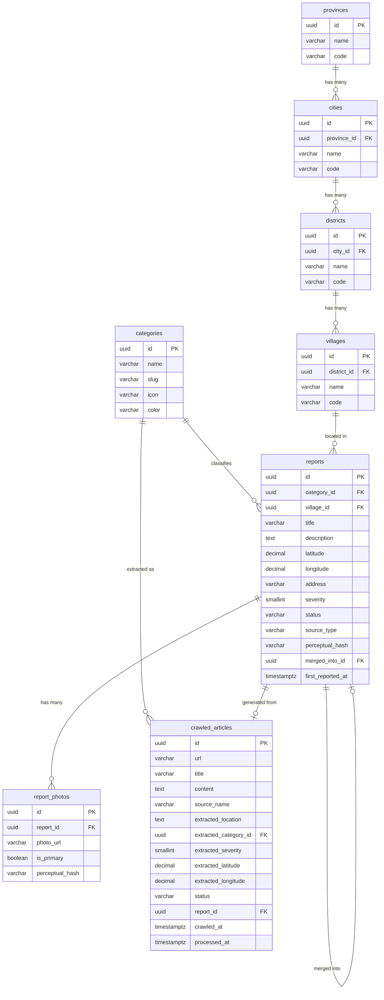

# Fixora — Database Schema Design

> **Scope awal:** DKI Jakarta  
> **Database:** PostgreSQL  
> **Total tabel:** 8

---

## 1. Wilayah (Region Tables)

Hierarki administratif Indonesia: Provinsi → Kota/Kabupaten → Kecamatan → Kelurahan.  
Data di-seed manual untuk DKI Jakarta (1 provinsi, 6 kota, ~44 kecamatan, ~267 kelurahan).

---

### `provinces`

| Field | Type | Constraint | Penjelasan |
|---|---|---|---|
| `id` | `UUID` | PK, default `gen_random_uuid()` | Primary key unik untuk setiap provinsi |
| `name` | `VARCHAR(100)` | NOT NULL | Nama provinsi, contoh: `"DKI Jakarta"` |
| `code` | `VARCHAR(10)` | NOT NULL, UNIQUE | Kode administratif BPS, contoh: `"31"` untuk DKI Jakarta. Berguna untuk integrasi data pemerintah di masa depan |
| `created_at` | `TIMESTAMPTZ` | NOT NULL, default `NOW()` | Waktu record dibuat |
| `updated_at` | `TIMESTAMPTZ` | NOT NULL, default `NOW()` | Waktu record terakhir diupdate |

---

### `cities`

| Field | Type | Constraint | Penjelasan |
|---|---|---|---|
| `id` | `UUID` | PK | Primary key unik untuk setiap kota/kabupaten |
| `province_id` | `UUID` | FK → `provinces.id`, NOT NULL | Relasi ke provinsi induk |
| `name` | `VARCHAR(100)` | NOT NULL | Nama kota/kabupaten, contoh: `"Jakarta Selatan"`, `"Kepulauan Seribu"` |
| `code` | `VARCHAR(10)` | NOT NULL, UNIQUE | Kode BPS kota, contoh: `"31.74"` untuk Jakarta Selatan |
| `created_at` | `TIMESTAMPTZ` | NOT NULL, default `NOW()` | Waktu record dibuat |
| `updated_at` | `TIMESTAMPTZ` | NOT NULL, default `NOW()` | Waktu record terakhir diupdate |

---

### `districts`

| Field | Type | Constraint | Penjelasan |
|---|---|---|---|
| `id` | `UUID` | PK | Primary key unik untuk setiap kecamatan |
| `city_id` | `UUID` | FK → `cities.id`, NOT NULL | Relasi ke kota/kabupaten induk |
| `name` | `VARCHAR(100)` | NOT NULL | Nama kecamatan, contoh: `"Tebet"`, `"Kebayoran Baru"` |
| `code` | `VARCHAR(15)` | NOT NULL, UNIQUE | Kode BPS kecamatan, contoh: `"31.74.05"` untuk Tebet |
| `created_at` | `TIMESTAMPTZ` | NOT NULL, default `NOW()` | Waktu record dibuat |
| `updated_at` | `TIMESTAMPTZ` | NOT NULL, default `NOW()` | Waktu record terakhir diupdate |

---

### `villages`

| Field | Type | Constraint | Penjelasan |
|---|---|---|---|
| `id` | `UUID` | PK | Primary key unik untuk setiap kelurahan |
| `district_id` | `UUID` | FK → `districts.id`, NOT NULL | Relasi ke kecamatan induk |
| `name` | `VARCHAR(100)` | NOT NULL | Nama kelurahan, contoh: `"Menteng Dalam"`, `"Bukit Duri"` |
| `code` | `VARCHAR(20)` | NOT NULL, UNIQUE | Kode BPS kelurahan, contoh: `"31.74.05.1003"` untuk Menteng Dalam |
| `created_at` | `TIMESTAMPTZ` | NOT NULL, default `NOW()` | Waktu record dibuat |
| `updated_at` | `TIMESTAMPTZ` | NOT NULL, default `NOW()` | Waktu record terakhir diupdate |

---

## 2. Kategori

### `categories`

Lookup table untuk jenis masalah infrastruktur. Data awal: jalan rusak, jembatan, sampah, bangunan terbengkalai, drainase.

| Field | Type | Constraint | Penjelasan |
|---|---|---|---|
| `id` | `UUID` | PK | Primary key unik untuk setiap kategori |
| `name` | `VARCHAR(50)` | NOT NULL, UNIQUE | Nama kategori yang ditampilkan ke user, contoh: `"Jalan Rusak"`, `"Drainase Tersumbat"` |
| `slug` | `VARCHAR(50)` | NOT NULL, UNIQUE | Versi URL-friendly dari nama, contoh: `"jalan-rusak"`, `"drainase-tersumbat"`. Dipakai untuk filter query parameter di API & URL frontend |
| `icon` | `VARCHAR(50)` | NULLABLE | Nama/kode icon untuk marker di peta, contoh: `"road-crack"`, `"bridge"`. Biar frontend tahu icon mana yang ditampilkan per kategori |
| `color` | `VARCHAR(7)` | NULLABLE | Hex color code untuk warna marker di peta, contoh: `"#E53E3E"` (merah untuk jalan rusak). Biar setiap kategori punya warna berbeda dan mudah dibedakan secara visual |
| `created_at` | `TIMESTAMPTZ` | NOT NULL, default `NOW()` | Waktu record dibuat |
| `updated_at` | `TIMESTAMPTZ` | NOT NULL, default `NOW()` | Waktu record terakhir diupdate |

---

## 3. Report (Entitas Utama)

### `reports`

Tabel inti Fixora — setiap row merepresentasikan **satu titik masalah infrastruktur** di peta, baik dari laporan warga maupun hasil deteksi AI news crawler.

| Field | Type | Constraint | Penjelasan |
|---|---|---|---|
| `id` | `UUID` | PK | Primary key unik untuk setiap laporan |
| `category_id` | `UUID` | FK → `categories.id`, NOT NULL | Kategori masalah (jalan rusak, sampah, dll). Di-set manual oleh pelapor atau otomatis oleh AI (CV classifier / news extraction) |
| `village_id` | `UUID` | FK → `villages.id`, NOT NULL | Kelurahan tempat masalah berada. Level paling detail dari hierarki wilayah — dari sini bisa di-trace naik ke kecamatan → kota → provinsi lewat JOIN |
| `title` | `VARCHAR(200)` | NOT NULL | Judul singkat laporan, contoh: `"Jalan Berlubang di Jl. Casablanca"`. Bisa diisi manual oleh pelapor atau auto-generated oleh AI dari konteks berita |
| `description` | `TEXT` | NULLABLE | Deskripsi detail masalah (opsional sesuai PRD). Pelapor boleh kosongkan, foto yang wajib |
| `latitude` | `DECIMAL(10,8)` | NOT NULL | Koordinat GPS latitude titik masalah. Dipakai untuk menampilkan marker di peta. Contoh: `-6.23456789` |
| `longitude` | `DECIMAL(11,8)` | NOT NULL | Koordinat GPS longitude titik masalah. Contoh: `106.84567890` |
| `address` | `VARCHAR(500)` | NULLABLE | Alamat lengkap dalam format teks yang human-readable, contoh: `"Jl. Casablanca Raya No. 12, Menteng Dalam, Tebet"`. Bisa di-resolve dari koordinat GPS via reverse geocoding, atau diisi manual |
| `severity` | `SMALLINT` | NOT NULL, CHECK (1–5) | Skor keparahan masalah (1 = ringan, 5 = kritis). Di-set otomatis oleh CV classifier saat foto diupload, atau oleh LLM saat parsing berita. Dipakai untuk prioritas sorting & filter di peta |
| `status` | `VARCHAR(25)` | NOT NULL, default `'pending_verification'` | Status lifecycle laporan. Nilai yang mungkin: `pending_verification` (baru masuk, belum divalidasi), `verified` (sudah lolos validasi), `mangkrak` (terverifikasi masih rusak/terbengkalai), `dalam_perbaikan` (ada indikasi sedang diperbaiki), `selesai` (masalah sudah teratasi) |
| `source_type` | `VARCHAR(15)` | NOT NULL | Asal-usul data laporan. Nilai: `user_report` (dilaporkan langsung oleh warga via form) atau `ai_news` (terdeteksi otomatis oleh AI news crawler dari media). Ditampilkan sebagai badge di UI untuk transparansi |
| `perceptual_hash` | `VARCHAR(64)` | NULLABLE | Hash dari foto utama laporan, dihasilkan oleh algoritma perceptual hashing (bukan hash kriptografis). Dipakai untuk deteksi duplikat — dua foto yang secara visual mirip akan menghasilkan hash yang mirip, meskipun resolusi/kompresi berbeda |
| `merged_into_id` | `UUID` | FK → `reports.id`, NULLABLE | Jika laporan ini terdeteksi sebagai duplikat dan di-merge ke laporan lain, field ini menunjuk ke ID laporan induk. Laporan yang sudah di-merge tidak ditampilkan di peta (soft-merge), tapi datanya tetap tersimpan |
| `first_reported_at` | `TIMESTAMPTZ` | NOT NULL | Tanggal pertama kali masalah ini dilaporkan/terdeteksi. Ini yang jadi acuan menghitung **"sudah berapa lama masalah dibiarkan"** — fitur kunci diferensiasi Fixora |
| `created_at` | `TIMESTAMPTZ` | NOT NULL, default `NOW()` | Waktu record dibuat di database |
| `updated_at` | `TIMESTAMPTZ` | NOT NULL, default `NOW()` | Waktu record terakhir dimodifikasi |

**Index yang direkomendasikan:**
- `(latitude, longitude)` — spatial query untuk peta
- `(category_id)` — filter by kategori
- `(village_id)` — filter by wilayah
- `(status)` — filter by status
- `(source_type)` — filter by sumber data

---

## 4. Foto Laporan

### `report_photos`

Satu laporan bisa punya lebih dari satu foto. Foto pertama (primary) dipakai sebagai thumbnail di peta & untuk perceptual hashing.

| Field | Type | Constraint | Penjelasan |
|---|---|---|---|
| `id` | `UUID` | PK | Primary key unik untuk setiap foto |
| `report_id` | `UUID` | FK → `reports.id`, NOT NULL, ON DELETE CASCADE | Relasi ke laporan induk. Cascade delete — kalau report dihapus, foto ikut terhapus |
| `photo_url` | `VARCHAR(500)` | NOT NULL | URL/path ke file foto yang tersimpan di object storage (S3, MinIO, dll). Contoh: `"uploads/reports/abc123/photo1.jpg"` |
| `is_primary` | `BOOLEAN` | NOT NULL, default `false` | Menandai apakah foto ini adalah foto utama. Foto utama ditampilkan sebagai thumbnail di daftar/marker peta, dan dipakai untuk generate perceptual hash |
| `perceptual_hash` | `VARCHAR(64)` | NULLABLE | Hash perceptual dari foto ini. Dipakai untuk mendeteksi apakah foto yang sama/mirip sudah pernah diupload di laporan lain (deteksi duplikat cross-report) |
| `created_at` | `TIMESTAMPTZ` | NOT NULL, default `NOW()` | Waktu foto diupload |

---

## 5. AI News Crawler

### `crawled_articles`

Menyimpan artikel berita yang ditarik oleh AI news crawler. Setiap artikel melewati proses: **crawl → LLM extraction → validasi → (opsional) jadi report**.

| Field | Type | Constraint | Penjelasan |
|---|---|---|---|
| `id` | `UUID` | PK | Primary key unik untuk setiap artikel |
| `url` | `VARCHAR(1000)` | NOT NULL, UNIQUE | URL asli artikel berita. Di-set UNIQUE untuk mencegah crawling artikel yang sama berulang kali |
| `title` | `VARCHAR(500)` | NOT NULL | Judul artikel berita asli dari sumber media |
| `content` | `TEXT` | NULLABLE | Isi/ringkasan artikel. Disimpan untuk keperluan audit trail & re-processing jika LLM extraction pertama gagal atau kurang akurat |
| `source_name` | `VARCHAR(100)` | NOT NULL | Nama media sumber, contoh: `"Detik.com"`, `"Kompas"`, `"Tempo"`. Ditampilkan di UI sebagai bagian dari badge "Sumber: Media (Detik.com)" |
| `extracted_location` | `TEXT` | NULLABLE | Lokasi yang diekstrak oleh LLM dari teks berita dalam bentuk teks mentah, contoh: `"Jl. Gatot Subroto, Jakarta Selatan"`. Ini hasil mentah sebelum di-geocode jadi koordinat |
| `extracted_category_id` | `UUID` | FK → `categories.id`, NULLABLE | Kategori masalah yang diekstrak oleh LLM. Nullable karena LLM mungkin gagal menentukan kategori dari teks berita |
| `extracted_severity` | `SMALLINT` | NULLABLE, CHECK (1–5) | Skor severity yang diestimasi LLM dari konteks berita. Nullable karena tidak semua berita bisa dinilai severity-nya |
| `extracted_latitude` | `DECIMAL(10,8)` | NULLABLE | Latitude hasil geocoding dari `extracted_location`. Nullable karena geocoding bisa gagal |
| `extracted_longitude` | `DECIMAL(11,8)` | NULLABLE | Longitude hasil geocoding dari `extracted_location` |
| `status` | `VARCHAR(15)` | NOT NULL, default `'pending'` | Status processing artikel. Nilai: `pending` (baru di-crawl, belum diproses LLM), `processed` (sudah diekstrak & berhasil jadi report), `rejected` (diekstrak tapi tidak relevan/gagal validasi) |
| `report_id` | `UUID` | FK → `reports.id`, NULLABLE | Link ke report yang di-generate dari artikel ini. Nullable karena tidak semua artikel berhasil jadi report (bisa rejected). Ini membentuk traceability: dari report bisa di-trace balik ke artikel aslinya |
| `crawled_at` | `TIMESTAMPTZ` | NOT NULL | Waktu artikel di-crawl dari sumber media |
| `processed_at` | `TIMESTAMPTZ` | NULLABLE | Waktu artikel selesai diproses oleh LLM. Nullable karena artikel yang masih `pending` belum diproses |
| `created_at` | `TIMESTAMPTZ` | NOT NULL, default `NOW()` | Waktu record dibuat di database |
| `updated_at` | `TIMESTAMPTZ` | NOT NULL, default `NOW()` | Waktu record terakhir dimodifikasi |

---

## Diagram Relasi (ERD)

