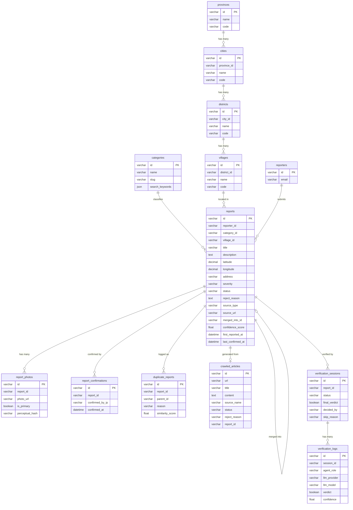

# Fixora — Database Schema

> **Database:** MySQL 8.0 (driver `gorm.io/driver/mysql`)
> **Total tabel:** 13
> **Source of truth:** entitas GORM di `internal/modules/*/src/entity` + `AutoMigrate` di tiap `module.go`.

Dokumen ini menggambarkan skema **aktual** yang dihasilkan dari entitas GORM di codebase, bukan rancangan. Referensi `budget_items`, `gov_datasets_sync_log`, dan `merge_logs` yang pernah ada di draft lama **tidak ada** di codebase dan telah dihapus dari dokumen ini.

---

## 1. Wilayah (Region Tables)

Hierarki administratif Indonesia: Provinsi → Kota/Kabupaten → Kecamatan → Kelurahan. Primary key tiap level memakai **kode BPS** (string), bukan UUID — memungkinkan pencocokan langsung (JOIN) dengan dataset pemerintah lain yang juga memakai kode wilayah standar.

> **Catatan scope:** seeder wilayah (`database/seeders/regions`) berisi **seluruh Indonesia** (37 provinsi, 514 kabupaten/kota), bukan hanya DKI Jakarta. Pembatasan wilayah diterapkan di layer crawler (scope Jabodetabek), bukan di data wilayah.

### `provinces`

| Field       | Type          | Constraint            | Penjelasan                  |
| ----------- | ------------- | --------------------- | --------------------------- |
| `id`        | `varchar(100)` | PK                    | Kode BPS, contoh: `"31"`    |
| `name`      | `varchar(100)` | NOT NULL              | Contoh: `"DKI Jakarta"`     |
| `code`      | `varchar(10)`  | NOT NULL, UNIQUE      | Kode BPS, contoh: `"31"`    |
| `created_at` | `datetime`     | NOT NULL, autoCreate  |                             |
| `updated_at` | `datetime`     | NOT NULL, autoUpdate  |                             |

### `cities`

| Field        | Type          | Constraint            | Penjelasan                      |
| ------------ | ------------- | --------------------- | ------------------------------- |
| `id`         | `varchar(100)` | PK                    | Kode BPS, contoh: `"31.74"`     |
| `province_id` | `varchar(100)` | NOT NULL              | Kode BPS provinsi (tanpa FK DB) |
| `name`       | `varchar(100)` | NOT NULL              | Contoh: `"Jakarta Selatan"`     |
| `code`       | `varchar(10)`  | NOT NULL, UNIQUE      | Contoh: `"31.74"`               |
| `created_at` | `datetime`     | NOT NULL, autoCreate  |                                 |
| `updated_at` | `datetime`     | NOT NULL, autoUpdate  |                                 |

### `districts`

| Field        | Type          | Constraint            | Penjelasan                      |
| ------------ | ------------- | --------------------- | ------------------------------- |
| `id`         | `varchar(100)` | PK                    | Kode BPS, contoh: `"31.74.05"`  |
| `city_id`    | `varchar(100)` | NOT NULL              | Kode BPS kota (tanpa FK DB)     |
| `name`       | `varchar(100)` | NOT NULL              | Contoh: `"Tebet"`               |
| `code`       | `varchar(15)`  | NOT NULL, UNIQUE      | Contoh: `"31.74.05"`            |
| `created_at` | `datetime`     | NOT NULL, autoCreate  |                                 |
| `updated_at` | `datetime`     | NOT NULL, autoUpdate  |                                 |

### `villages`

| Field         | Type          | Constraint            | Penjelasan                         |
| ------------- | ------------- | --------------------- | ---------------------------------- |
| `id`          | `varchar(100)` | PK                    | Kode BPS, contoh: `"31.74.05.1003"`|
| `district_id` | `varchar(100)` | NOT NULL              | Kode BPS kecamatan (tanpa FK DB)   |
| `name`        | `varchar(100)` | NOT NULL              | Contoh: `"Menteng Dalam"`          |
| `code`        | `varchar(20)`  | NOT NULL, UNIQUE      | Contoh: `"31.74.05.1003"`          |
| `created_at`  | `datetime`     | NOT NULL, autoCreate  |                                    |
| `updated_at`  | `datetime`     | NOT NULL, autoUpdate  |                                    |

---

## 2. Kategori

### `categories`

Lookup table jenis masalah infrastruktur. Seeder mengisi **4 kategori** (bukan 5 — `Drainase Tersumbat` tidak ada di codebase).

| Field             | Type         | Constraint               | Penjelasan                                                       |
| ----------------- | ------------ | ------------------------ | ---------------------------------------------------------------- |
| `id`              | `varchar(36)` | PK                       | UUID string                                                       |
| `name`            | `varchar(50)` | NOT NULL, UNIQUE         | `Sampah`, `Jalan Rusak`, `Jembatan Rusak`, `Bangunan Terbengkalai`|
| `slug`            | `varchar(50)` | NOT NULL, UNIQUE         | `sampah`, `jalan-rusak`, `jembatan-rusak`, `bangunan-terbengkalai`|
| `search_keywords` | `json`        | NULLABLE                 | Array keyword untuk query RSS crawler (tidak ada `icon`/`color`)  |
| `created_at`      | `datetime`    | NOT NULL, autoCreate     |                                                                   |
| `updated_at`      | `datetime`    | NOT NULL, autoUpdate     |                                                                   |

---

## 3. Pelapor

### `reporters`

Identitas pelapor ternormalisasi. **Hanya `email`** (tanpa `name`). Tidak ditampilkan publik.

| Field        | Type          | Constraint           | Penjelasan        |
| ------------ | ------------- | -------------------- | ----------------- |
| `id`         | `varchar(36)` | PK                   | UUID string       |
| `email`      | `varchar(150)`| NOT NULL             |                   |
| `created_at` | `datetime`    | NOT NULL, autoCreate |                   |

---

## 4. Report (Entitas Utama)

### `reports`

Satu baris = satu titik masalah infrastruktur, dari sumber apa pun.

| Field               | Type            | Constraint              | Penjelasan                                                                  |
| ------------------- | --------------- | ----------------------- | --------------------------------------------------------------------------- |
| `id`                | `varchar(36)`   | PK                      | UUID string (atau `RPT-<slug>-<date>-<rand>` untuk report crawler)          |
| `reporter_id`       | `varchar(36)`   | NULLABLE                | NULL jika sumber `ai_news`/`gov_data` (tanpa FK DB)                          |
| `category_id`       | `varchar(36)`   | NOT NULL                |                                                                             |
| `village_id`        | `varchar(36)`   | NOT NULL                |                                                                             |
| `title`             | `varchar(200)`  | NOT NULL                |                                                                             |
| `description`       | `text`          | NULLABLE                |                                                                             |
| `latitude`          | `decimal(10,8)` | NOT NULL                |                                                                             |
| `longitude`         | `decimal(11,8)` | NOT NULL                |                                                                             |
| `address`           | `varchar(500)`  | NULLABLE                |                                                                             |
| `severity`          | `varchar(10)`   | NOT NULL                | `ringan` / `sedang` / `parah`                                                |
| `status`            | `varchar(25)`   | NOT NULL, default `'pending_verification'` | `pending_verification` / `verified` / `rejected`          |
| `reject_reason`     | `text`          | NULLABLE                | Diisi saat status `rejected` oleh verifikasi                                |
| `source_type`       | `varchar(15)`   | NOT NULL                | `user_report` / `ai_news` / `gov_data`                                       |
| `source_url`        | `varchar(700)`  | NULLABLE                | URL artikel asli (untuk `ai_news`)                                          |
| `merged_into_id`    | `varchar(36)`   | NULLABLE                | Soft-merge duplikat (self-reference, tanpa FK DB)                            |
| `confidence_score`  | `float`         | NOT NULL, default `1.0` |                                                                             |
| `first_reported_at` | `datetime`      | NOT NULL                | Acuan hitung durasi mangkrak                                                |
| `last_confirmed_at` | `datetime`      | NULLABLE                | Update tiap ada konfirmasi "masih begini"                                    |
| `created_at`        | `datetime`      | NOT NULL, autoCreate    |                                                                             |
| `updated_at`        | `datetime`      | NOT NULL, autoUpdate    |                                                                             |

> **Catatan:** `budget_info` yang pernah ada di draft lama **tidak ada** di entity. Field `source_url` dan `reject_reason` adalah tambahan aktual yang tidak tercantum di draft.

---

## 5. Foto Laporan

### `report_photos`

| Field             | Type          | Constraint              | Penjelasan                              |
| ----------------- | ------------- | ----------------------- | --------------------------------------- |
| `id`              | `varchar(36)` | PK                      | UUID string                             |
| `report_id`       | `varchar(36)` | NOT NULL                | (tanpa FK DB; relasi GORM cascade)      |
| `photo_url`       | `varchar(500)`| NOT NULL                |                                         |
| `is_primary`      | `boolean`     | NOT NULL, default `false`|                                        |
| `perceptual_hash` | `varchar(64)` | NULLABLE                | pHash hex untuk deteksi duplikat        |
| `created_at`      | `datetime`    | NOT NULL, autoCreate    |                                         |

---

## 6. Konfirmasi Laporan (US-04)

### `report_confirmations`

| Field             | Type          | Constraint           | Penjelasan                                  |
| ----------------- | ------------- | -------------------- | ------------------------------------------- |
| `id`              | `varchar(36)` | PK                   | UUID string                                 |
| `report_id`       | `varchar(36)` | NOT NULL             | (tanpa FK DB; relasi GORM cascade)          |
| `confirmed_by_ip` | `varchar(45)` | NULLABLE             | Anti-spam ringan                            |
| `confirmed_at`    | `datetime`    | NOT NULL, autoCreate |                                             |

> **Status implementasi:** tabel + repository (anti-spam 24 jam via `HasConfirmedByIP`) sudah ada, namun **belum ada endpoint/usecase** untuk membuat konfirmasi.

---

## 7. Audit Trail Duplikat (US-07)

### `duplicate_reports`

| Field              | Type          | Constraint           | Penjelasan                              |
| ------------------ | ------------- | -------------------- | --------------------------------------- |
| `id`               | `varchar(36)` | PK                   | UUID string                             |
| `report_id`        | `varchar(36)` | NOT NULL             | Report yang di-merge / dibandingkan      |
| `parent_id`        | `varchar(36)` | NOT NULL             | Report induk (bukan `duplicate_of_...`) |
| `reason`           | `varchar(50)` | NOT NULL             | `nearby_location` / `identical_photo`    |
| `similarity_score` | `float`       | NOT NULL             | 0..1                                    |
| `created_at`       | `datetime`    | NOT NULL, autoCreate |                                         |

> Tabel bernama `duplicate_reports` (bukan `merge_logs`).

---

## 8. AI News Crawler

### `crawled_articles`

| Field           | Type           | Constraint                    | Penjelasan                                            |
| --------------- | -------------- | ----------------------------- | ----------------------------------------------------- |
| `id`            | `varchar(100)` | PK                            | `ART-<source>-<YYYYMMDD>-<rand>`                      |
| `url`           | `varchar(700)` | NOT NULL, UNIQUE              | Kunci dedup                                          |
| `title`         | `varchar(500)` | NOT NULL                      |                                                       |
| `content`       | `text`         | NULLABLE                      | Audit trail & re-processing                           |
| `source_name`   | `varchar(100)` | NOT NULL                      | `"Google News RSS"`                                  |
| `status`        | `varchar(15)`  | NOT NULL, default `'pending'` | `pending` / `processed` / `rejected`                  |
| `reject_reason` | `varchar(100)` | NULLABLE                      | `not_relevant`, `category_not_found`, dst.            |
| `report_id`     | `varchar(100)` | NULLABLE                      | Traceability ke report hasil ekstraksi                |
| `published_at`  | `datetime`     | NULLABLE                      | Waktu publikasi RSS                                   |
| `crawled_at`    | `datetime`     | NOT NULL                      |                                                       |
| `processed_at`  | `datetime`     | NULLABLE                      |                                                       |
| `created_at`    | `datetime`     | NOT NULL, autoCreate          |                                                       |
| `updated_at`    | `datetime`     | NOT NULL, autoUpdate          |                                                       |

> **Catatan:** nilai `status` aktual yang ditulis codebase adalah `processed` (setelah report terbuat) dan `rejected`; default `pending`. Hasil ekstraksi LLM bersifat transient dan **tidak disimpan** (tidak ada kolom `extracted_*`).

---

## 9. Verifikasi (Multi-Agent)

### `verification_sessions`

| Field                 | Type          | Constraint               | Penjelasan                                                  |
| --------------------- | ------------- | ------------------------ | ----------------------------------------------------------- |
| `id`                  | `varchar(36)` | PK                       | UUID string                                                 |
| `report_id`           | `varchar(100)`| NOT NULL, index          |                                                             |
| `status`              | `varchar(20)` | NOT NULL, default `'pending'`, index | `pending` / `in_progress` / `approved` / `rejected` / `error` |
| `final_verdict`       | `boolean`     | NULLABLE                 |                                                             |
| `final_category_slug` | `varchar(50)` | NULLABLE                 |                                                             |
| `final_severity`      | `varchar(10)` | NULLABLE                 |                                                             |
| `final_reasoning`     | `text`        | NULLABLE                 |                                                             |
| `reject_reason`       | `text`        | NULLABLE                 |                                                             |
| `decided_by`          | `varchar(20)` | NULLABLE                 | `consensus` / `manager` / `ai_news` / `gov_data`            |
| `skip_reason`         | `varchar(50)` | NULLABLE                 | Diisi saat auto-approve (`ai_news`/`gov_data`)              |
| `started_at`          | `datetime`    | NULLABLE                 |                                                             |
| `completed_at`        | `datetime`    | NULLABLE                 |                                                             |
| `created_at`          | `datetime`    | NOT NULL, autoCreate     |                                                             |
| `updated_at`          | `datetime`    | NOT NULL, autoUpdate     |                                                             |

### `verification_logs`

| Field            | Type          | Constraint               | Penjelasan                            |
| ---------------- | ------------- | ------------------------ | ------------------------------------- |
| `id`             | `varchar(36)` | PK                       | UUID string                           |
| `session_id`     | `varchar(36)` | NOT NULL, index          | (relasi GORM cascade)                 |
| `agent_role`     | `varchar(20)` | NOT NULL                 | `advocate` / `skeptic` / `manager`    |
| `llm_provider`   | `varchar(20)` | NOT NULL                 | `CommandCode`                         |
| `llm_model`      | `varchar(50)` | NOT NULL                 | `qwen/qwen3.7-flash`                  |
| `verdict`        | `boolean`     | NULLABLE                 |                                       |
| `confidence`     | `float`       | NOT NULL, default `0`    | 0..1                                  |
| `category_slug`  | `varchar(50)` | NULLABLE                 |                                       |
| `severity`       | `varchar(10)` | NULLABLE                 |                                       |
| `raw_argument`   | `text`        | NOT NULL                 |                                       |
| `prompt_used`    | `text`        | NOT NULL                 |                                       |
| `latency_ms`     | `int`         | NOT NULL, default `0`    |                                       |
| `error_message`  | `text`        | NULLABLE                 |                                       |
| `created_at`     | `datetime`    | NOT NULL, autoCreate     |                                       |

---

## Ringkasan Tabel (13)

| # | Tabel                   | Modul        | Migrasi via                          |
| - | ----------------------- | ------------ | ------------------------------------ |
| 1 | `provinces`             | region       | `region/module.go`                   |
| 2 | `cities`                | region       | `region/module.go`                   |
| 3 | `districts`             | region       | `region/module.go`                   |
| 4 | `villages`              | region       | `region/module.go`                   |
| 5 | `categories`            | report       | `report/module.go`                   |
| 6 | `reporters`             | report       | `report/module.go`                   |
| 7 | `reports`               | report       | `report/module.go`                   |
| 8 | `report_photos`         | report       | `report/module.go`                   |
| 9 | `report_confirmations`  | report       | `report/module.go`                   |
| 10| `duplicate_reports`     | report       | `report/module.go`                   |
| 11| `crawled_articles`      | crawl        | `crawl/module.go`                    |
| 12| `verification_sessions` | verification | `verification/module.go`             |
| 13| `verification_logs`     | verification | `verification/module.go`             |

---

## Diagram Relasi (ERD)

```mermaid
erDiagram
    provinces ||--o{ cities : "has many"
    cities ||--o{ districts : "has many"
    districts ||--o{ villages : "has many"

    categories ||--o{ reports : "classifies"
    villages ||--o{ reports : "located in"
    reporters ||--o{ reports : "submits"

    reports ||--o{ report_photos : "has many"
    reports ||--o{ report_confirmations : "confirmed by"
    reports ||--o| reports : "merged into"
    reports ||--o{ duplicate_reports : "logged as"

    reports ||--o| crawled_articles : "generated from"

    reports ||--o{ verification_sessions : "verified by"
    verification_sessions ||--o{ verification_logs : "has many"

    provinces {
        varchar id PK
        varchar name
        varchar code
    }
    cities {
        varchar id PK
        varchar province_id
        varchar name
        varchar code
    }
    districts {
        varchar id PK
        varchar city_id
        varchar name
        varchar code
    }
    villages {
        varchar id PK
        varchar district_id
        varchar name
        varchar code
    }
    categories {
        varchar id PK
        varchar name
        varchar slug
        json search_keywords
    }
    reporters {
        varchar id PK
        varchar email
    }
    reports {
        varchar id PK
        varchar reporter_id
        varchar category_id
        varchar village_id
        varchar title
        text description
        decimal latitude
        decimal longitude
        varchar address
        varchar severity
        varchar status
        text reject_reason
        varchar source_type
        varchar source_url
        varchar merged_into_id
        float confidence_score
        datetime first_reported_at
        datetime last_confirmed_at
    }
    report_photos {
        varchar id PK
        varchar report_id
        varchar photo_url
        boolean is_primary
        varchar perceptual_hash
    }
    report_confirmations {
        varchar id PK
        varchar report_id
        varchar confirmed_by_ip
        datetime confirmed_at
    }
    duplicate_reports {
        varchar id PK
        varchar report_id
        varchar parent_id
        varchar reason
        float similarity_score
    }
    crawled_articles {
        varchar id PK
        varchar url
        varchar title
        text content
        varchar source_name
        varchar status
        varchar reject_reason
        varchar report_id
    }
    verification_sessions {
        varchar id PK
        varchar report_id
        varchar status
        boolean final_verdict
        varchar decided_by
        varchar skip_reason
    }
    verification_logs {
        varchar id PK
        varchar session_id
        varchar agent_role
        varchar llm_provider
        varchar llm_model
        boolean verdict
        float confidence
    }
```
