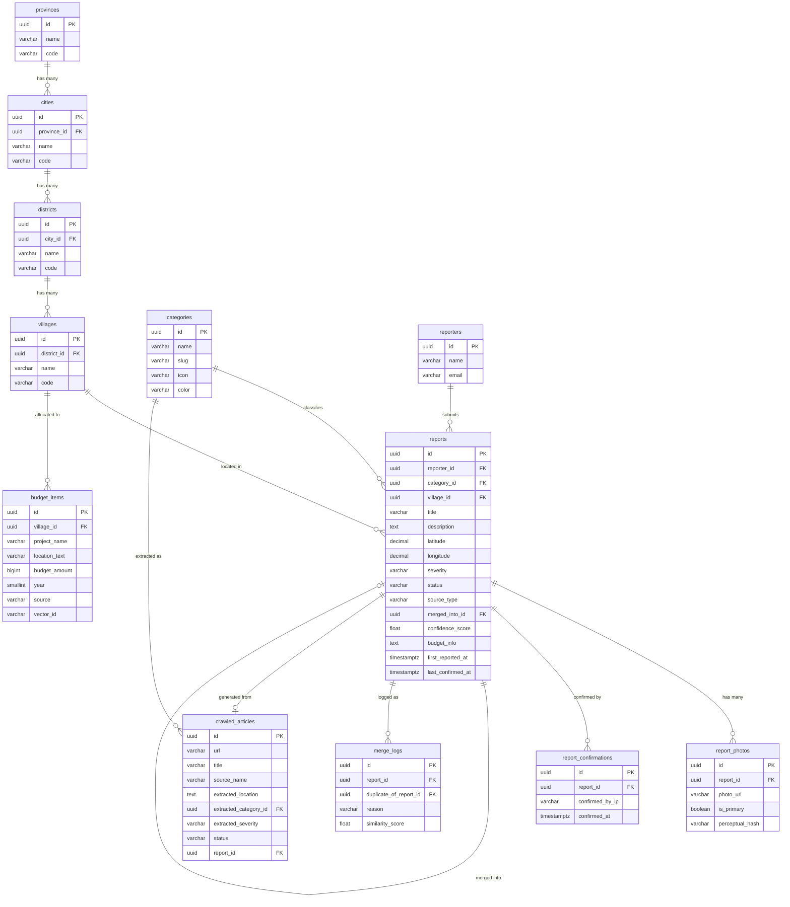

# Fixora — Database Schema (Final)

> **Scope awal:** DKI Jakarta
> **Database:** PostgreSQL
> **Total tabel:** 13

Dokumen ini adalah hasil gabungan dari rancangan region hierarchy & categories lookup (yang sudah baik), dikoreksi dan dilengkapi agar selaras penuh dengan PRD — termasuk tracking konfirmasi (US-04), pelapor (US-02), sumber data pemerintah (US-08), dan pipeline RAG.

---

## 1. Wilayah (Region Tables)

Hierarki administratif Indonesia: Provinsi → Kota/Kabupaten → Kecamatan → Kelurahan. Kode BPS di tiap level memungkinkan pencocokan langsung (JOIN) dengan dataset pemerintah lain yang juga pakai kode wilayah standar — mengurangi beban pada RAG untuk kasus yang bisa dicocokkan secara eksak.

### `provinces`

| Field                       | Type           | Constraint                      | Penjelasan               |
| --------------------------- | -------------- | ------------------------------- | ------------------------ |
| `id`                        | `UUID`         | PK, default `gen_random_uuid()` |                          |
| `name`                      | `VARCHAR(100)` | NOT NULL                        | Contoh: `"DKI Jakarta"`  |
| `code`                      | `VARCHAR(10)`  | NOT NULL, UNIQUE                | Kode BPS, contoh: `"31"` |
| `created_at` / `updated_at` | `TIMESTAMPTZ`  | NOT NULL, default `NOW()`       |                          |

### `cities`

| Field                       | Type           | Constraint                    | Penjelasan                  |
| --------------------------- | -------------- | ----------------------------- | --------------------------- |
| `id`                        | `UUID`         | PK                            |                             |
| `province_id`               | `UUID`         | FK → `provinces.id`, NOT NULL |                             |
| `name`                      | `VARCHAR(100)` | NOT NULL                      | Contoh: `"Jakarta Selatan"` |
| `code`                      | `VARCHAR(10)`  | NOT NULL, UNIQUE              | Contoh: `"31.74"`           |
| `created_at` / `updated_at` | `TIMESTAMPTZ`  | NOT NULL, default `NOW()`     |                             |

### `districts`

| Field                       | Type           | Constraint                 | Penjelasan           |
| --------------------------- | -------------- | -------------------------- | -------------------- |
| `id`                        | `UUID`         | PK                         |                      |
| `city_id`                   | `UUID`         | FK → `cities.id`, NOT NULL |                      |
| `name`                      | `VARCHAR(100)` | NOT NULL                   | Contoh: `"Tebet"`    |
| `code`                      | `VARCHAR(15)`  | NOT NULL, UNIQUE           | Contoh: `"31.74.05"` |
| `created_at` / `updated_at` | `TIMESTAMPTZ`  | NOT NULL, default `NOW()`  |                      |

### `villages`

| Field                       | Type           | Constraint                    | Penjelasan                |
| --------------------------- | -------------- | ----------------------------- | ------------------------- |
| `id`                        | `UUID`         | PK                            |                           |
| `district_id`               | `UUID`         | FK → `districts.id`, NOT NULL |                           |
| `name`                      | `VARCHAR(100)` | NOT NULL                      | Contoh: `"Menteng Dalam"` |
| `code`                      | `VARCHAR(20)`  | NOT NULL, UNIQUE              | Contoh: `"31.74.05.1003"` |
| `created_at` / `updated_at` | `TIMESTAMPTZ`  | NOT NULL, default `NOW()`     |                           |

---

## 2. Kategori

### `categories`

Lookup table jenis masalah infrastruktur (jalan rusak, jembatan, sampah, bangunan terbengkalai, drainase).

| Field                       | Type          | Constraint                | Penjelasan                                               |
| --------------------------- | ------------- | ------------------------- | -------------------------------------------------------- |
| `id`                        | `UUID`        | PK                        |                                                          |
| `name`                      | `VARCHAR(50)` | NOT NULL, UNIQUE          | Contoh: `"Jalan Rusak"`                                  |
| `slug`                      | `VARCHAR(50)` | NOT NULL, UNIQUE          | Contoh: `"jalan-rusak"`, dipakai untuk filter di URL/API |
| `created_at` / `updated_at` | `TIMESTAMPTZ` | NOT NULL, default `NOW()` |                                                          |

---

## 3. Pelapor _(baru ditambahkan)_

### `reporters`

Menyimpan identitas pelapor secara ternormalisasi — 1 orang bisa mengirim banyak laporan. Nama disimpan untuk keperluan internal (verifikasi/follow-up), **tidak ditampilkan publik** di peta sesuai kesepakatan sebelumnya.

| Field        | Type           | Constraint                | Penjelasan                      |
| ------------ | -------------- | ------------------------- | ------------------------------- |
| `id`         | `UUID`         | PK                        |                                 |
| `name`       | `VARCHAR(150)` | NOT NULL                  | Nama pelapor, internal-only     |
| `email`      | `VARCHAR(150)` | NOT NULL                  | Untuk notifikasi status laporan |
| `created_at` | `TIMESTAMPTZ`  | NOT NULL, default `NOW()` |                                 |

---

## 4. Report (Entitas Utama)

### `reports`

Satu row = satu titik masalah infrastruktur di peta, dari sumber apa pun (warga, AI news, atau data resmi pemerintah).

| Field                       | Type            | Constraint                                  | Penjelasan                                                                     |
| --------------------------- | --------------- | ------------------------------------------- | ------------------------------------------------------------------------------ |
| `id`                        | `UUID`          | PK                                          |                                                                                |
| `reporter_id`               | `UUID`          | FK → `reporters.id`, NULLABLE               | **Baru.** Null jika sumbernya `ai_news` atau `gov_data`                        |
| `category_id`               | `UUID`          | FK → `categories.id`, NOT NULL              |                                                                                |
| `village_id`                | `UUID`          | FK → `villages.id`, NOT NULL                |                                                                                |
| `title`                     | `VARCHAR(200)`  | NOT NULL                                    |                                                                                |
| `description`               | `TEXT`          | NULLABLE                                    |                                                                                |
| `latitude`                  | `DECIMAL(10,8)` | NOT NULL                                    |                                                                                |
| `longitude`                 | `DECIMAL(11,8)` | NOT NULL                                    |                                                                                |
| `address`                   | `VARCHAR(500)`  | NULLABLE                                    |                                                                                |
| `severity`                  | `VARCHAR(10)`   | NOT NULL, CHECK (`ringan`,`sedang`,`parah`) | **Dikoreksi** dari `SMALLINT 1–5` menjadi 3 level, selaras dengan US-06 di PRD |
| `status`                    | `VARCHAR(25)`   | NOT NULL, default `'pending_verification'`  | `pending_verification`, `verified`, `mangkrak`, `dalam_perbaikan`, `selesai`   |
| `source_type`               | `VARCHAR(15)`   | NOT NULL                                    | **Dikoreksi:** `user_report`, `ai_news`, atau `gov_data` (US-08 ditambahkan)   |
| `merged_into_id`            | `UUID`          | FK → `reports.id`, NULLABLE                 | Soft-merge duplikat, alasannya dicatat di `merge_logs`                         |
| `confidence_score`          | `FLOAT`         | NOT NULL, default `1.0`                     | **Baru.** Untuk US-04, menurun seiring waktu sejak `last_confirmed_at`         |
| `budget_info`               | `TEXT`          | NULLABLE                                    | **Baru.** Hasil kesimpulan RAG (Fase 2)                                        |
| `first_reported_at`         | `TIMESTAMPTZ`   | NOT NULL                                    | Acuan hitung durasi mangkrak                                                   |
| `last_confirmed_at`         | `TIMESTAMPTZ`   | NULLABLE                                    | **Baru.** Update tiap ada konfirmasi "masih begini"                            |
| `created_at` / `updated_at` | `TIMESTAMPTZ`   | NOT NULL, default `NOW()`                   |                                                                                |

> **Catatan:** field `perceptual_hash` yang sebelumnya ada di tabel ini **dihapus** — sudah tersedia di `report_photos.perceptual_hash` (foto primary), sehingga tidak perlu disimpan dobel di dua tempat.

**Index yang direkomendasikan:**

- `(latitude, longitude)` — spatial query untuk peta
- `(category_id)`, `(village_id)`, `(status)`, `(source_type)` — filter
- `(first_reported_at)` — sorting berdasarkan durasi mangkrak

---

## 5. Foto Laporan

### `report_photos`

Satu laporan bisa punya banyak foto. Foto primary dipakai sebagai thumbnail & sumber perceptual hash utama.

| Field             | Type           | Constraint                                     | Penjelasan                          |
| ----------------- | -------------- | ---------------------------------------------- | ----------------------------------- |
| `id`              | `UUID`         | PK                                             |                                     |
| `report_id`       | `UUID`         | FK → `reports.id`, NOT NULL, ON DELETE CASCADE |                                     |
| `photo_url`       | `VARCHAR(500)` | NOT NULL                                       |                                     |
| `is_primary`      | `BOOLEAN`      | NOT NULL, default `false`                      |                                     |
| `perceptual_hash` | `VARCHAR(64)`  | NULLABLE                                       | Untuk deteksi duplikat cross-report |
| `created_at`      | `TIMESTAMPTZ`  | NOT NULL, default `NOW()`                      |                                     |

---

## 6. Konfirmasi Laporan _(baru ditambahkan — US-04)_

### `report_confirmations`

Log setiap kali warga mengonfirmasi "masih begini" pada suatu laporan. Dipisah dari `reports` agar histori konfirmasi tidak hilang dan bisa dihitung frekuensinya.

| Field             | Type          | Constraint                                     | Penjelasan                                   |
| ----------------- | ------------- | ---------------------------------------------- | -------------------------------------------- |
| `id`              | `UUID`        | PK                                             |                                              |
| `report_id`       | `UUID`        | FK → `reports.id`, NOT NULL, ON DELETE CASCADE |                                              |
| `confirmed_by_ip` | `VARCHAR(45)` | NULLABLE                                       | Anti-spam ringan (laporan tidak wajib login) |
| `confirmed_at`    | `TIMESTAMPTZ` | NOT NULL, default `NOW()`                      |                                              |

---

## 7. Audit Trail Duplikat _(baru ditambahkan)_

### `merge_logs`

Mencatat alasan & skor kemiripan saat dua laporan digabungkan (US-07), agar keputusan sistem bisa diaudit — melengkapi `reports.merged_into_id` yang sifatnya cuma pointer tanpa konteks.

| Field                    | Type          | Constraint                  | Penjelasan                                   |
| ------------------------ | ------------- | --------------------------- | -------------------------------------------- |
| `id`                     | `UUID`        | PK                          |                                              |
| `report_id`              | `UUID`        | FK → `reports.id`, NOT NULL | Laporan yang di-merge                        |
| `duplicate_of_report_id` | `UUID`        | FK → `reports.id`, NOT NULL | Laporan induk                                |
| `reason`                 | `VARCHAR(50)` | NOT NULL                    | `foto_identik`, `radius_lokasi_dekat`, dll   |
| `similarity_score`       | `FLOAT`       | NOT NULL                    | Skor dari perceptual hash / jarak geospasial |
| `created_at`             | `TIMESTAMPTZ` | NOT NULL, default `NOW()`   |                                              |

---

## 8. AI News Crawler

### `crawled_articles`

Artikel berita yang ditarik AI news crawler, melewati proses: crawl → LLM extraction → validasi → (opsional) jadi report.

| Field                       | Type            | Constraint                    | Penjelasan                                           |
| --------------------------- | --------------- | ----------------------------- | ---------------------------------------------------- |
| `id`                        | `VARCHAR(100)`  | PK                            | Special ID, contoh `ART-google-news-rss-20260731-a1b2` |
| `url`                       | `VARCHAR(1000)` | NOT NULL, UNIQUE              | Kunci dedup — mencegah crawl ulang artikel yang sama |
| `title`                     | `VARCHAR(500)`  | NOT NULL                      |                                                      |
| `content`                   | `TEXT`          | NULLABLE                      | Untuk audit trail & re-processing                    |
| `source_name`               | `VARCHAR(100)`  | NOT NULL                      | Contoh: `"Google News RSS"`                         |
| `status`                    | `VARCHAR(15)`   | NOT NULL, default `'pending'` | `pending`, `processed`, `rejected`                   |
| `reject_reason`             | `VARCHAR(100)`  | NULLABLE                      | Alasan artikel ditolak oleh pipeline crawler         |
| `report_id`                 | `VARCHAR(100)`  | NULLABLE                      | Traceability ke report hasil ekstraksi               |
| `published_at`              | `DATETIME`      | NULLABLE                      | Waktu publikasi dari RSS                             |
| `crawled_at`                | `DATETIME`      | NOT NULL                      |                                                      |
| `processed_at`              | `DATETIME`      | NULLABLE                      |                                                      |
| `created_at` / `updated_at` | `DATETIME`      | NOT NULL, default current time |                                                     |

---

## 9. Data Anggaran Pemerintah _(baru ditambahkan — RAG)_

### `budget_items`

Data anggaran dari portal open data pemerintah (prioritas: SatuData Jakarta), menjadi bahan pencarian RAG untuk cross-reference dengan `reports`.

| Field           | Type           | Constraint                   | Penjelasan                                                                              |
| --------------- | -------------- | ---------------------------- | --------------------------------------------------------------------------------------- |
| `id`            | `UUID`         | PK                           |                                                                                         |
| `village_id`    | `UUID`         | FK → `villages.id`, NULLABLE | Diisi jika berhasil dicocokkan ke kode wilayah standar (jalur JOIN langsung, tanpa RAG) |
| `project_name`  | `VARCHAR(300)` | NOT NULL                     |                                                                                         |
| `location_text` | `VARCHAR(500)` | NOT NULL                     | Teks lokasi mentah dari sumber data                                                     |
| `budget_amount` | `BIGINT`       | NOT NULL                     | Dalam Rupiah                                                                            |
| `year`          | `SMALLINT`     | NOT NULL                     |                                                                                         |
| `agency`        | `VARCHAR(150)` | NULLABLE                     | Instansi pelaksana                                                                      |
| `source`        | `VARCHAR(50)`  | NOT NULL                     | `satudata_jakarta`, `sirup`, `apbd`, dll — mendukung ekspansi sumber per wilayah        |
| `vector_id`     | `VARCHAR(100)` | NULLABLE                     | Referensi ID di Qdrant untuk sinkronisasi ulang                                         |
| `created_at`    | `TIMESTAMPTZ`  | NOT NULL, default `NOW()`    |                                                                                         |

---

## 10. Sinkronisasi Dataset Pemerintah _(baru ditambahkan — US-08)_

### `gov_datasets_sync_log`

Tracking sinkronisasi data dari portal pemerintah (kondisi infrastruktur & anggaran), agar tidak perlu menarik ulang seluruh data tiap kali proses berjalan.

| Field            | Type           | Constraint                | Penjelasan                                                 |
| ---------------- | -------------- | ------------------------- | ---------------------------------------------------------- | --- |
| `id`             | `UUID`         | PK                        |                                                            |
| `dataset_name`   | `VARCHAR(100)` | NOT NULL                  | Contoh: `"jalan_kondisi_jakarta"`                          |
| `dataset_type`   | `VARCHAR(20)`  | NOT NULL                  | `condition` (→ `reports`) atau `budget` (→ `budget_items`) |
| `last_synced_at` | `TIMESTAMPTZ`  | NOT NULL                  |                                                            |
| `records_synced` | `INTEGER`      | NOT NULL, default `0`     |                                                            |
| `status`         | `VARCHAR(15)`  | NOT NULL                  | `success`, `failed`                                        |     |
| `created_at`     | `TIMESTAMPTZ`  | NOT NULL, default `NOW()` |                                                            |

---

## Ringkasan Perubahan dari Draft Sebelumnya

| Perubahan            | Detail                                                                                              |
| -------------------- | --------------------------------------------------------------------------------------------------- |
| ➕ Ditambahkan       | `reporters`, `report_confirmations`, `merge_logs`, `budget_items`, `gov_datasets_sync_log`          |
| ✏️ Dikoreksi         | `reports.severity`: `SMALLINT(1–5)` → `VARCHAR` 3 level (selaras US-06)                             |
| ✏️ Dikoreksi         | `reports.source_type`: tambah nilai `gov_data` (selaras US-08)                                      |
| ✏️ Dikoreksi         | `reports.perceptual_hash` dihapus (redundan dengan `report_photos.perceptual_hash`)                 |
| ➕ Ditambahkan field | `reports.reporter_id`, `confidence_score`, `budget_info`, `last_confirmed_at`                       |
| ✅ Dipertahankan     | Region hierarchy (`provinces`→`villages`), `categories` lookup, `report_photos`, `crawled_articles` |

---

## Diagram Relasi (ERD)

```mermaid
erDiagram
    provinces ||--o{ cities : "has many"
    cities ||--o{ districts : "has many"
    districts ||--o{ villages : "has many"

    categories ||--o{ reports : "classifies"
    villages ||--o{ reports : "located in"
    reporters ||--o{ reports : "submits"

    reports ||--o{ report_photos : "has many"
    reports ||--o{ report_confirmations : "confirmed by"
    reports ||--o| reports : "merged into"
    reports ||--o{ merge_logs : "logged as"

    categories ||--o{ crawled_articles : "extracted as"
    reports ||--o| crawled_articles : "generated from"

    villages ||--o{ budget_items : "allocated to"

    provinces {
        uuid id PK
        varchar name
        varchar code
    }
    cities {
        uuid id PK
        uuid province_id FK
        varchar name
        varchar code
    }
    districts {
        uuid id PK
        uuid city_id FK
        varchar name
        varchar code
    }
    villages {
        uuid id PK
        uuid district_id FK
        varchar name
        varchar code
    }
    categories {
        uuid id PK
        varchar name
        varchar slug
        varchar icon
        varchar color
    }
    reporters {
        uuid id PK
        varchar name
        varchar email
    }
    reports {
        uuid id PK
        uuid reporter_id FK
        uuid category_id FK
        uuid village_id FK
        varchar title
        text description
        decimal latitude
        decimal longitude
        varchar severity
        varchar status
        varchar source_type
        uuid merged_into_id FK
        float confidence_score
        text budget_info
        timestamptz first_reported_at
        timestamptz last_confirmed_at
    }
    report_photos {
        uuid id PK
        uuid report_id FK
        varchar photo_url
        boolean is_primary
        varchar perceptual_hash
    }
    report_confirmations {
        uuid id PK
        uuid report_id FK
        varchar confirmed_by_ip
        timestamptz confirmed_at
    }
    merge_logs {
        uuid id PK
        uuid report_id FK
        uuid duplicate_of_report_id FK
        varchar reason
        float similarity_score
    }
    crawled_articles {
        uuid id PK
        varchar url
        varchar title
        varchar source_name
        text extracted_location
        uuid extracted_category_id FK
        varchar extracted_severity
        varchar status
        uuid report_id FK
    }
    budget_items {
        uuid id PK
        uuid village_id FK
        varchar project_name
        varchar location_text
        bigint budget_amount
        smallint year
        varchar source
        varchar vector_id
    }
```
