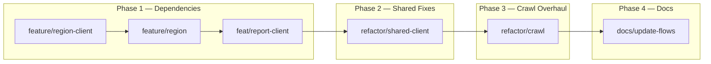

# Implementation Plan: Resolve Audit Findings — Modular Monolith & Crawl Module

## Konteks

Plan ini merupakan tindak lanjut dari [laporan audit](file:///C:/Users/traa/.gemini/antigravity-ide/brain/38778216-a830-4ede-96e6-9e24512e5576/implementation_plan_audit.md) dan diskusi design yang sudah disepakati:

| #   | Keputusan Design                                                         | Ref Diskusi   |
| --- | ------------------------------------------------------------------------ | ------------- |
| D1  | Keywords crawl dari DB (`categories`), bukan hardcode                    | Poin 1        |
| D2  | Village tidak ketemu → reject artikel, hanya insert data lengkap         | Poin 2        |
| D3  | Geocode return lat/lon/address saja, village resolution terpisah         | Poin 3        |
| D4  | Entity `CrawledArticle` lean — tanpa extracted lat/lon/category/severity | Poin 4        |
| D5  | Database MySQL, special ID format untuk article & report                 | Poin 5        |
| D6  | LLM return category name/slug, resolusi ke UUID di usecase               | Poin 6        |
| D7  | Region jadi module terpisah dengan `region-client`                       | Diskusi akhir |

---

## Overview Phase & Branch



> [!IMPORTANT]
> Setiap branch harus di-merge/push terlebih dahulu sebelum branch berikutnya dimulai (sequential dependency). Branch `feature/region` bergantung pada `feature/region-client`, dst.

---

## Phase 1 — Dependencies

### Branch 1: `feature/region-client`

**Scope:** Buat package `region-client` — contract interface + types yang akan dipakai module lain (crawl, report) untuk akses data wilayah.

---

#### [NEW] `internal/modules/region-client/client.go`

Interface contract module region:

```go
package region_client

import "gorm.io/gorm"

type Client interface {
    // ResolveVillageByName mencari village berdasarkan nama dari address text.
    // Dipakai oleh crawl (dari Nominatim address) dan report (dari reverse geocoding).
    // Return nil, nil jika tidak ditemukan (bukan error).
    ResolveVillageByName(tx *gorm.DB, addressText string) (*VillageClientResponse, error)

    // GetAllCategories mengembalikan semua kategori (id, name, slug).
    // Dipakai oleh crawl worker untuk fetch keyword RSS dan resolusi slug → ID.
    // NOTE: kategori tetap dimiliki module report, tapi diexpose lewat sini
    // karena region-client sudah jadi gateway data referensi.
    // ALTERNATIVE: bisa juga diexpose via report-client — lihat Open Questions.
}
```

> [!IMPORTANT]
> **Open Question — Kategori diexpose dari mana?**
> Dua opsi:
>
> 1. Tambah `GetAllCategories` + `GetCategoryBySlug` ke `report-client` (karena category dimiliki report module)
> 2. Gabung ke `region-client` (karena region-client sudah jadi "gateway data referensi/lookup")
>
> Opsi 1 lebih sesuai prinsip ownership (category milik report). Opsi 2 lebih pragmatis (crawl cuma perlu inject 1 client, bukan 2). **Perlu keputusan owner.**

#### [NEW] `internal/modules/region-client/region_client_response.go`

```go
type VillageClientResponse struct {
    ID           string
    Name         string
    DistrictName string
    CityName     string
    ProvinceName string
}
```

**Commits di branch ini:**

```
feat(region-client): add region client interface and types
```

---

### Branch 2: `feature/region`

**Scope:** Buat module `region` — owns tabel wilayah, implements `region-client.Client`, responsible for `Migrate()`.

---

#### [NEW] `internal/modules/region/src/entity/province_entity.go`

Entity `Province` — id, name, code, timestamps.

#### [NEW] `internal/modules/region/src/entity/city_entity.go`

Entity `City` — id, province_id (FK in-module), name, code, timestamps.

#### [NEW] `internal/modules/region/src/entity/district_entity.go`

Entity `District` — id, city_id (FK in-module), name, code, timestamps.

#### [NEW] `internal/modules/region/src/entity/village_entity.go`

Entity `Village` — id, district_id (FK in-module), name, code, timestamps.

> FK antar tabel region (province→city→district→village) **boleh pakai GORM FK** karena semua dalam 1 module — sesuai AGENTS.md Bab 2.2 yang melarang FK **lintas modul**, bukan intra-modul.

#### [NEW] `internal/modules/region/src/repository/village_repository.go`

```go
type VillageRepository struct {
    shared_repo.Repository[entity.Village]
    Log *logrus.Logger
}

// SearchByName — cari village by nama (fuzzy match).
// Parse address text dari Nominatim, coba match ke nama kelurahan.
func (r *VillageRepository) SearchByName(db *gorm.DB, name string) (*entity.Village, error)
```

Method ini akan melakukan query `WHERE name LIKE ?` terhadap tabel `villages`, dengan preload district → city → province untuk data lengkap.

#### [NEW] `internal/modules/region/module.go`

Implement `module.Module` interface:

- `Migrate()` — AutoMigrate Province, City, District, Village
- `RegisterRoutes()` — (kosong untuk sekarang, atau bisa disiapkan untuk API wilayah nanti di Step 3 PROGRESS.md)

#### [NEW] `internal/modules/region/client_impl.go`

Implement `region_client.Client`:

- `ResolveVillageByName()` — parse address text, extract nama kelurahan/kecamatan, query ke `VillageRepository.SearchByName()`, return `VillageClientResponse` atau `nil` jika tidak ketemu.

**Strategi parsing address Nominatim:**
Nominatim `display_name` biasanya format: `"Jl. Gatot Subroto, Menteng Dalam, Tebet, Jakarta Selatan, DKI Jakarta, Indonesia"`.

- Split by `,` → trim spaces
- Iterasi setiap segmen → query `villages.name` → cari match pertama
- Jika tidak ada match → return `nil, nil`

**Commits di branch ini:**

```
feat(region): add province entity
feat(region): add city entity
feat(region): add district entity
feat(region): add village entity
feat(region): add village repository with search by name
feat(region): add module contract implementation
feat(region): implement region client (village resolver)
```

---

### Branch 3: `feat/report-client`

**Scope:** Tambah method category ke `report-client` agar module lain bisa akses data kategori tanpa query langsung ke tabel milik report.

> [!NOTE]
> Jika keputusan Open Question di atas adalah "gabung ke region-client", skip branch ini dan tambahkan category methods ke region-client/region module. Plan ini ditulis dengan asumsi **category tetap diexpose via report-client** (opsi 1, sesuai prinsip ownership).

---

#### [MODIFY] `internal/modules/report-client/client.go`

Tambah methods:

```go
type Client interface {
    CreateReport(tx *gorm.DB, req *ReportClientRequest) (*ReportClientResponse, error)

    // NEW — untuk crawl module
    GetAllCategories(tx *gorm.DB) ([]CategoryClientResponse, error)
    GetCategoryBySlug(tx *gorm.DB, slug string) (*CategoryClientResponse, error)
}
```

#### [NEW] `internal/modules/report-client/category_client_response.go`

```go
type CategoryClientResponse struct {
    ID   string
    Name string
    Slug string
}
```

#### [MODIFY] `internal/modules/report/client_impl.go`

Tambah implementasi:

```go
func (c *clientImpl) GetAllCategories(tx *gorm.DB) ([]report_client.CategoryClientResponse, error) {
    // query via categoryRepository.FindAll()
    // convert entity → client response
}

func (c *clientImpl) GetCategoryBySlug(tx *gorm.DB, slug string) (*report_client.CategoryClientResponse, error) {
    // query via categoryRepository.FindBySlug()
    // return nil, nil jika tidak ketemu
}
```

#### [MODIFY] `internal/modules/report/src/repository/category_repository.go`

Tambah method `FindBySlug`:

```go
func (r *CategoryRepository) FindBySlug(db *gorm.DB, item *entity.Category, slug string) error {
    return db.Where("slug = ?", slug).Take(item).Error
}
```

**Commits di branch ini:**

```
feat(report-client): add category client response type
feat(report-client): add GetAllCategories and GetCategoryBySlug to client interface
feat(report): add FindBySlug to category repository
feat(report): implement category methods in client_impl
```

---

## Phase 2 — Shared Fixes

### Branch 4: `refactor/shared-client`

**Scope:** Fix Nominatim client — hapus `VillageID` dari `GeocodeResult`, fix lat/lon parsing. Bersihkan package agar benar-benar generik.

**Resolves:** BUG-01 (partial), BUG-04

---

#### [MODIFY] `internal/shared/client/nominatim_client.go`

Perubahan:

1. **Hapus `VillageID` dari struct `GeocodeResult`** (D3):

```go
// BEFORE
type GeocodeResult struct {
    Latitude  float64
    Longitude float64
    Address   string
    VillageID string  // ← HAPUS
}

// AFTER
type GeocodeResult struct {
    Latitude  float64
    Longitude float64
    Address   string
}
```

2. **Fix lat/lon parsing** — ganti `fmt.Sscanf` dengan `strconv.ParseFloat` + error check (BUG-04):

```go
// BEFORE
fmt.Sscanf(first.Lat, "%f", &lat)
fmt.Sscanf(first.Lon, "%f", &lon)

// AFTER
lat, err := strconv.ParseFloat(first.Lat, 64)
if err != nil {
    c.Log.Warnf("Failed to parse latitude '%s': %+v", first.Lat, err)
    return nil, fmt.Errorf("invalid latitude from Nominatim: %s", first.Lat)
}
lon, err := strconv.ParseFloat(first.Lon, 64)
if err != nil {
    c.Log.Warnf("Failed to parse longitude '%s': %+v", first.Lon, err)
    return nil, fmt.Errorf("invalid longitude from Nominatim: %s", first.Lon)
}
```

3. **Hapus kode dummy VillageID** — return `GeocodeResult` tanpa VillageID.

#### [DELETE] `internal/shared/client/llm_client.go`

File ini akan dipindahkan ke module crawl di Phase 3. Hapus dari shared.

#### [DELETE] `internal/shared/client/rss_client.go`

File ini akan dipindahkan ke module crawl di Phase 3. Hapus dari shared.

> Setelah perubahan ini, `shared/client/` hanya berisi `nominatim_client.go` — yang memang generik (pure geocoding tanpa domain logic) dan akan dipakai oleh report module juga.

**Commits di branch ini:**

```
refactor(shared-client): remove VillageID from GeocodeResult
fix(shared-client): replace Sscanf with ParseFloat for lat/lon parsing
refactor(shared-client): remove llm_client (move to crawl in next phase)
refactor(shared-client): remove rss_client (move to crawl in next phase)
```

---

## Phase 3 — Crawl Module Overhaul

### Branch 5: `refactor/crawl`

**Scope:** Rewrite besar module crawl — relocate LLM+RSS clients, simplify entity, rewrite usecase & worker sesuai semua keputusan design.

**Resolves:** BUG-01, BUG-02, BUG-03, BUG-05, BUG-06, BUG-07, BUG-08, BUG-10, BUG-11, dan semua keputusan D1–D7.

---

#### [NEW] `internal/modules/crawl/src/infra/llm_client.go`

Pindah dari `shared/client/llm_client.go` + perbaikan:

1. **Fix schema mismatch** (BUG-02) — property `"category"` align dengan JSON tag `json:"category"`:

```go
type ExtractionResult struct {
    Location   string `json:"location"`
    Category   string `json:"category"`     // slug/nama, BUKAN UUID
    Severity   string `json:"severity"`
    IsRelevant bool   `json:"is_relevant"`
}
```

2. **Fix schema Required** — `"category_id"` → `"category"`:

```go
Required: []string{"location", "category", "severity", "is_relevant"},
```

3. **Fix schema Properties** — rename property dari `"category"` (sudah benar) dan pastikan `Description` konsisten.

#### [NEW] `internal/modules/crawl/src/infra/rss_client.go`

Pindah dari `shared/client/rss_client.go` tanpa perubahan logic (sudah cukup fungsional). Hanya pindah package.

---

#### [MODIFY] `internal/modules/crawl/src/entity/crawled_article_entity.go`

Simplify entity (D4) — hapus field `Extracted*`:

```go
// BEFORE (29 lines, banyak field Extracted*)
type CrawledArticle struct {
    ID                  string
    URL                 string
    Title               string
    Content             *string
    SourceName          string
    ExtractedLocation   *string     // ← HAPUS
    ExtractedCategoryID *string     // ← HAPUS
    ExtractedSeverity   *string     // ← HAPUS
    ExtractedLatitude   *float64    // ← HAPUS
    ExtractedLongitude  *float64    // ← HAPUS
    Status              string
    ReportID            *string
    CrawledAt           *time.Time
    ProcessedAt         *time.Time
    CreatedAt           *time.Time
    UpdatedAt           *time.Time
}

// AFTER — lean, to the point
type CrawledArticle struct {
    ID          string     `gorm:"column:id;primaryKey;type:varchar(100)"`
    URL         string     `gorm:"column:url;type:varchar(1000);not null;uniqueIndex"`
    Title       string     `gorm:"column:title;type:varchar(500);not null"`
    Content     *string    `gorm:"column:content;type:text"`
    SourceName  string     `gorm:"column:source_name;type:varchar(100);not null"`
    Status      string     `gorm:"column:status;type:varchar(15);not null;default:'pending'"`
    RejectReason *string   `gorm:"column:reject_reason;type:varchar(100)"`
    ReportID    *string    `gorm:"column:report_id;type:varchar(100)"`
    PublishedAt *time.Time `gorm:"column:published_at"`
    CrawledAt   *time.Time `gorm:"column:crawled_at;not null"`
    ProcessedAt *time.Time `gorm:"column:processed_at"`
    CreatedAt   *time.Time `gorm:"column:created_at;autoCreateTime"`
    UpdatedAt   *time.Time `gorm:"column:updated_at;autoUpdateTime"`
}
```

Perubahan:

- Hapus semua field `Extracted*` (D4 — data ini hanya transient, tidak di-persist)
- Tambah `RejectReason` (untuk audit trail kenapa artikel di-reject, BUG-07)
- Tambah `PublishedAt` (waktu publikasi RSS, BUG-08)
- PK type jadi `varchar(100)` untuk special ID (D5)

#### [NEW] `internal/modules/crawl/src/infra/id_generator.go`

Utility untuk generate special ID (D5):

```go
// GenerateArticleID menghasilkan ID unik untuk crawled article.
// Format: ART-<source>-<YYYYMMDD>-<random>
func GenerateArticleID(sourceName string) string
```

---

#### [MODIFY] `internal/modules/crawl/src/model/crawler_request.go`

Hapus dependency ke `shared/client`:

```go
// BEFORE — import shared/client types
type ProcessCrawledArticleRequest struct {
    // ...
    Extraction *client.ExtractionResult
    Geocode    *client.GeocodeResult
}

// AFTER — self-contained, pakai types dari crawl/src/infra
type ProcessCrawledArticleRequest struct {
    URL         string
    Title       string
    Content     string
    SourceName  string
    PublishedAt time.Time
    CrawledAt   time.Time

    // Hasil extraction & geocoding (transient, untuk mapping ke report)
    CategoryID  string   // Sudah resolved dari slug → UUID
    VillageID   string   // Sudah resolved dari address → village
    Latitude    float64
    Longitude   float64
    Address     string
    Severity    string
}
```

---

#### [MODIFY] `internal/modules/crawl/src/repository/crawled_repository.go`

Tambah method untuk simpan rejected article:

```go
func (r *CrawledRepository) SaveRejected(db *gorm.DB, article *entity.CrawledArticle) error {
    article.Status = "rejected"
    now := time.Now()
    article.ProcessedAt = &now
    return db.Create(article).Error
}
```

---

#### [MODIFY] `internal/modules/crawl/src/usecase/crawler_usecase.go`

Rewrite major — perubahan DI dan logic:

**Struct & Constructor:**

```go
type CrawlerUseCase struct {
    DB                       *gorm.DB
    Log                      *logrus.Logger
    Validate                 *validator.Validate
    CrawledArticleRepository *repository.CrawledRepository
    ReportClient             report_client.Client   // untuk CreateReport
    RegionClient             region_client.Client    // untuk ResolveVillage (D3, D7)
}
```

**Method `SaveCrawledReport`** — sekarang menerima request yang sudah fully-resolved (categoryID dan villageID sudah berupa ID valid):

```go
func (c *CrawlerUseCase) SaveCrawledReport(ctx context.Context, req *model.ProcessCrawledArticleRequest) error {
    tx := c.DB.WithContext(ctx).Begin()
    defer tx.Rollback()

    // 1. Generate special ID untuk article (D5)
    articleID := infra.GenerateArticleID(req.SourceName)

    // 2. Insert crawled_article (lean, tanpa extracted fields — D4)
    crawled := &entity.CrawledArticle{
        ID:          articleID,
        URL:         req.URL,
        Title:       req.Title,
        Content:     &req.Content,
        SourceName:  req.SourceName,
        PublishedAt: &req.PublishedAt,
        CrawledAt:   &req.CrawledAt,
        Status:      "processed",
    }
    // ... create + error handling

    // 3. Create report via report-client
    report := &report_client.ReportClientRequest{
        CategoryID:      req.CategoryID,   // ← sudah UUID, bukan slug
        VillageID:       req.VillageID,    // ← sudah ID dari DB, bukan dummy
        Title:           req.Title,
        Latitude:        req.Latitude,
        Longitude:       req.Longitude,
        Address:         &req.Address,
        Severity:        req.Severity,
        Status:          "pending_verification",
        SourceType:      "ai_news",
        ConfidenceScore: 0.8,
        FirstReportedAt: &req.PublishedAt,  // ← waktu publikasi berita (D8/BUG-08)
    }
    // ... create report + update crawled article report_id + commit
}
```

**Method baru `SaveRejectedArticle`** (BUG-07):

```go
func (c *CrawlerUseCase) SaveRejectedArticle(ctx context.Context, url, title, content, sourceName, reason string, publishedAt, crawledAt time.Time) error {
    // Insert ke crawled_articles dengan status "rejected" + reason
    // Supaya URL tercatat dan tidak di-fetch ulang
}
```

---

#### [MODIFY] `internal/modules/crawl/src/worker/crawler_worker.go`

Rewrite major — perubahan DI dan flow:

**Struct:**

```go
type CrawlerWorker struct {
    Log             *logrus.Logger
    RssClient       infra.RssClient          // ← dari crawl/src/infra, bukan shared/client
    LlmClient       infra.LlmClient          // ← dari crawl/src/infra, bukan shared/client
    NominatimClient client.NominatimClient    // ← dari shared/client (tetap shared, generik)
    CrawlerUseCase  *usecase.CrawlerUseCase
    ReportClient    report_client.Client      // ← untuk fetch categories (D1)
    RegionClient    region_client.Client      // ← untuk resolve village (D3)
    Cron            *cron.Cron
}
```

**Method `RunCrawler` rewrite (D1 — keywords dari DB):**

```go
func (w *CrawlerWorker) RunCrawler() {
    ctx, cancel := context.WithTimeout(context.Background(), 30*time.Minute) // BUG-11 fix
    defer cancel()

    // D1: Fetch categories dari DB, bukan hardcode
    categories, err := w.ReportClient.GetAllCategories(w.CrawlerUseCase.DB.WithContext(ctx))
    if err != nil {
        w.Log.Warnf("Failed to fetch categories: %+v", err)
        return
    }

    // Kumpulkan semua artikel dulu, dedup in-memory (BUG-06 fix)
    allArticles := make(map[string]infra.RSSArticle) // key: URL
    for _, cat := range categories {
        keyword := cat.Name // misal "Jalan Rusak"
        articles, err := w.RssClient.FetchArticles(ctx, keyword)
        if err != nil {
            w.Log.Warnf("Failed to fetch RSS for '%s': %+v", keyword, err)
            continue
        }
        for _, art := range articles {
            if _, exists := allArticles[art.URL]; !exists {
                allArticles[art.URL] = art
            }
        }
    }

    // Filter yang sudah diproses (bulk check)
    // Lalu process concurrently (dengan semaphore + per-goroutine context)
    w.processArticles(ctx, allArticles)
}
```

**Method `processArticles` rewrite — full pipeline per artikel:**

```go
func (w *CrawlerWorker) processArticles(ctx context.Context, articles map[string]infra.RSSArticle) {
    var wg sync.WaitGroup
    semaphore := make(chan struct{}, 5)

    for _, article := range articles {
        // Cek dedup (DB) — sinkron
        if w.CrawlerUseCase.IsArticleProcessed(ctx, article.URL) {
            continue
        }

        wg.Add(1)
        semaphore <- struct{}{}

        go func(art infra.RSSArticle) {
            defer wg.Done()
            defer func() { <-semaphore }()

            // Per-goroutine context with timeout (BUG-11)
            artCtx, cancel := context.WithTimeout(ctx, 2*time.Minute)
            defer cancel()

            crawledAt := time.Now()
            publishedAt := parsePublishedAt(art.PublishedAt) // BUG-08 fix

            // 1. LLM extraction
            extraction, err := w.LlmClient.ExtractNewsInfo(artCtx, art.Title, art.Content)
            if err != nil || extraction == nil {
                // BUG-07: simpan sebagai rejected
                w.CrawlerUseCase.SaveRejectedArticle(artCtx, art.URL, art.Title, art.Content, art.SourceName, "llm_extraction_failed", publishedAt, crawledAt)
                return
            }

            if !extraction.IsRelevant {
                // BUG-07: simpan sebagai rejected
                w.CrawlerUseCase.SaveRejectedArticle(artCtx, art.URL, art.Title, art.Content, art.SourceName, "not_relevant", publishedAt, crawledAt)
                return
            }

            // 2. Resolve category slug → UUID (D6)
            category, err := w.ReportClient.GetCategoryBySlug(w.CrawlerUseCase.DB.WithContext(artCtx), extraction.Category)
            if err != nil || category == nil {
                w.CrawlerUseCase.SaveRejectedArticle(artCtx, art.URL, art.Title, art.Content, art.SourceName, "category_not_found", publishedAt, crawledAt)
                return
            }

            // 3. Geocoding (Nominatim) — pure lat/lon/address (D3)
            geocode, err := w.NominatimClient.Geocode(artCtx, extraction.Location)
            if err != nil || geocode == nil {
                w.CrawlerUseCase.SaveRejectedArticle(artCtx, art.URL, art.Title, art.Content, art.SourceName, "geocoding_failed", publishedAt, crawledAt)
                return
            }

            // 4. Resolve village dari address (D2, D3, D7)
            village, err := w.RegionClient.ResolveVillageByName(w.CrawlerUseCase.DB.WithContext(artCtx), geocode.Address)
            if err != nil || village == nil {
                // D2: village tidak ketemu → reject (hanya insert data lengkap)
                w.CrawlerUseCase.SaveRejectedArticle(artCtx, art.URL, art.Title, art.Content, art.SourceName, "village_not_resolved", publishedAt, crawledAt)
                return
            }

            // 5. Semua data lengkap → simpan (D4)
            req := &model.ProcessCrawledArticleRequest{
                URL:         art.URL,
                Title:       art.Title,
                Content:     art.Content,
                SourceName:  art.SourceName,
                PublishedAt: publishedAt,
                CrawledAt:   crawledAt,
                CategoryID:  category.ID,    // UUID dari DB
                VillageID:   village.ID,      // UUID dari DB
                Latitude:    geocode.Latitude,
                Longitude:   geocode.Longitude,
                Address:     geocode.Address,
                Severity:    extraction.Severity,
            }

            if err := w.CrawlerUseCase.SaveCrawledReport(artCtx, req); err != nil {
                w.Log.Warnf("Failed to save crawled report: %+v", err)
            }
        }(article)
    }

    wg.Wait()
}
```

---

#### [MODIFY] `internal/modules/crawl/module.go`

Implement `module.Module`:

- `Migrate()` — AutoMigrate `CrawledArticle`
- `RegisterRoutes()` — kosong untuk sekarang (crawler berjalan via cron, bukan HTTP endpoint)

**Commits di branch ini (atomic, sesuai git convention):**

```
feat(crawl): add llm client to crawl infra (relocated from shared)
feat(crawl): add rss client to crawl infra (relocated from shared)
feat(crawl): add article ID generator utility
refactor(crawl): simplify crawled article entity
refactor(crawl): update crawler request model (remove shared client dependency)
feat(crawl): add SaveRejected method to crawled repository
refactor(crawl): rewrite crawler usecase with region and category resolution
refactor(crawl): rewrite crawler worker with DB-driven keywords and full pipeline
feat(crawl): implement module contract (Migrate + RegisterRoutes)
chore(crawl): remove empty placeholder files (client_impl.go, route.go)
```

---

## Phase 4 — Documentation Sync

### Branch 6: `docs/update-flows`

**Scope:** Update dokumentasi yang tidak lagi selaras setelah refactor.

---

#### [MODIFY] `docs/DATABASE-SCHEMA.md`

- Update tabel `crawled_articles`: hapus field `extracted_*` (latitude, longitude, category_id, severity), tambah `reject_reason`, `published_at`
- Konfirmasi database engine: MySQL 8.0 (bukan PostgreSQL)
- Update PK type: `varchar(100)` untuk special ID
- Hapus referensi `gen_random_uuid()` (fungsi PostgreSQL)

#### [MODIFY] `docs/SYSTEM-FLOW-CRAWLER.md`

- Fase 1: keyword dari DB (bukan hardcode)
- Fase 4: Geocoding hanya return lat/lon/address, village resolution terpisah
- Fase 4: Jika village tidak ditemukan → reject (bukan skip silently)
- Fase 5: Artikel rejected tetap disimpan dengan `reject_reason`
- Update mapping backend table

#### [MODIFY] `docs/PROGRESS.md`

- Step 1 catatan: hapus "village_id harus nullable" (sudah final NOT NULL)
- Step 6: update deskripsi sesuai flow baru

#### [MODIFY] `go.mod`

- Hapus duplicate entry `google/generative-ai-go` (BUG-10)

**Commits di branch ini:**

```
docs(database-schema): update crawled_articles table and confirm MySQL
docs(system-flow-crawler): update flow to match refactored pipeline
docs(progress): fix village_id nullable note
chore: remove duplicate dependency in go.mod
```

---

## Mapping Bug → Fix

| Bug ID | Severity    | Fix Location                                         | Branch                                      |
| ------ | ----------- | ---------------------------------------------------- | ------------------------------------------- |
| BUG-01 | 🔴 Critical | Hapus VillageID dari GeocodeResult + region resolver | `refactor/shared-client` + `refactor/crawl` |
| BUG-02 | 🔴 Critical | Fix LLM schema alignment (`category`)                | `refactor/crawl`                            |
| BUG-03 | 🟠 High     | Special ID generator                                 | `refactor/crawl`                            |
| BUG-04 | 🟠 High     | `strconv.ParseFloat`                                 | `refactor/shared-client`                    |
| BUG-05 | 🟠 High     | Category slug → UUID via report-client               | `refactor/crawl`                            |
| BUG-06 | 🟡 Medium   | In-memory dedup by URL sebelum dispatch              | `refactor/crawl`                            |
| BUG-07 | 🟡 Medium   | `SaveRejectedArticle` method                         | `refactor/crawl`                            |
| BUG-08 | 🟡 Medium   | Parse `PublishedAt` dari RSS                         | `refactor/crawl`                            |
| BUG-09 | 🟡 Medium   | **Bukan bug** — MySQL confirmed benar                | N/A                                         |
| BUG-10 | 🟢 Low      | Hapus duplicate dep go.mod                           | `docs/update-flows`                         |
| BUG-11 | 🟢 Low      | Per-goroutine context with timeout                   | `refactor/crawl`                            |

---

## Verification Plan

### Per Branch

| Branch                   | Verifikasi                                                                                                                     |
| ------------------------ | ------------------------------------------------------------------------------------------------------------------------------ |
| `feature/region-client`  | `go build ./...` — pastikan compile tanpa error                                                                                |
| `feature/region`         | `go build ./...` + manual test: inject mock data villages, panggil `ResolveVillageByName()`                                    |
| `feat/report-client`     | `go build ./...` + manual test: `GetCategoryBySlug("jalan")` return data valid                                                 |
| `refactor/shared-client` | `go build ./...` + manual test: `Geocode()` return tanpa VillageID, lat/lon parsed benar                                       |
| `refactor/crawl`         | `go build ./...` + manual test: run crawler sekali, verify artikel masuk ke `crawled_articles` + `reports` dengan data lengkap |
| `docs/update-flows`      | Review manual dokumen                                                                                                          |

### End-to-End

Setelah semua branch merged:

1. Seed data categories (5 kategori) + villages (dataset wilayah.id DKI Jakarta)
2. Jalankan crawler manual (`RunCrawler()`)
3. Verify:
   - Artikel dari RSS terproses → `crawled_articles` terisi
   - Report terbuat di `reports` dengan `village_id` valid (FK match ke villages)
   - Report punya `category_id` valid (FK match ke categories)
   - Report punya `first_reported_at` dari waktu publikasi berita
   - Artikel rejected tersimpan di `crawled_articles` dengan `status: rejected` + `reject_reason`
   - Tidak ada artikel duplikat (URL unique)

---

## Open Questions

> [!IMPORTANT]
> **Q1: Category diexpose dari mana?**
>
> - **Opsi A:** Tambah `GetAllCategories` + `GetCategoryBySlug` ke `report-client` (karena category dimiliki report module). Crawl inject 2 client: `report-client` + `region-client`.
> - **Opsi B:** Gabung ke `region-client` sebagai "gateway data referensi". Crawl inject 1 client: `region-client`.
> - **Rekomendasi:** Opsi A — ownership lebih jelas, sesuai prinsip AGENTS.md. 2 client bukan masalah besar.

> [!IMPORTANT]
> **Q2: Format exact special ID?**
> Kamu menyebut format seperti `report-name-tanggal-`. Perlu keputusan exact format:
>
> - Article: `ART-<source>-<YYYYMMDD>-<random4>`? Contoh: `ART-detik-20260731-a1b2`
> - Report: `RPT-<category_slug>-<YYYYMMDD>-<random4>`? Contoh: `RPT-jalan-20260731-c3d4`
> - Atau format lain?

> [!IMPORTANT]
> **Q3: Bagaimana strategy parsing address Nominatim → village name?**
> Nominatim `display_name` format: `"Jl. Gatot Subroto, Menteng Dalam, Tebet, Jakarta Selatan, DKI Jakarta, 12870, Indonesia"`.
>
> - **Opsi A:** Split by `,` → iterasi setiap segmen → query `villages.name` WHERE exact match → ambil yang pertama ketemu.
> - **Opsi B:** Split by `,` → coba match di beberapa level sekaligus (village name, district name) → pilih yang paling spesifik.
> - **Opsi C:** Pakai Nominatim **reverse geocoding** endpoint (`/reverse?lat=X&lon=Y`) yang return structured address (ada field `suburb`, `city_district`, dll) — lebih reliable daripada parsing display_name.
> - **Rekomendasi:** Opsi C — Nominatim reverse geocoding punya field terstruktur, tidak perlu parsing string yang fragile.
